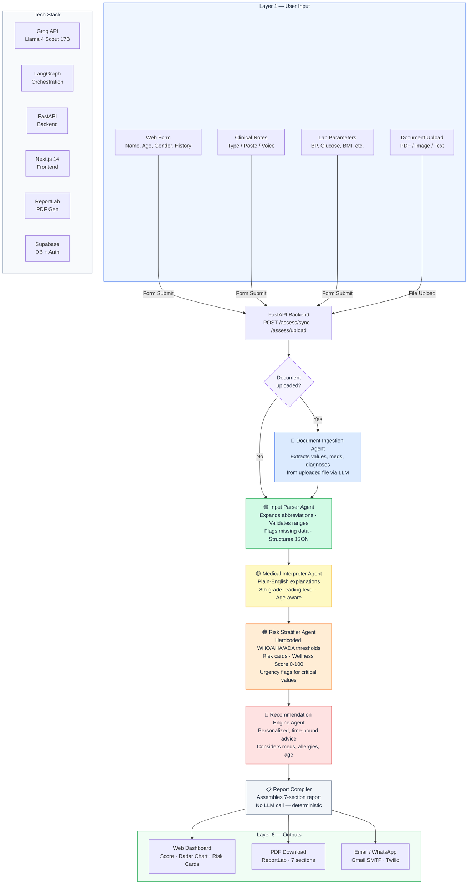

# HealthSync AI — Architecture Flow



## Pipeline Summary

```
User ──► Form / Upload ──► FastAPI ──► [Doc Ingestion?] ──► Input Parser ──► Medical Interpreter ──► Risk Stratifier ──► Recommendations ──► Report Compiler ──► Dashboard + PDF
              │                              │                   │                  │                      │                    │                       │
              │                         Extract text         Structure          Plain English         Risk Cards            Actionable            7-section
              │                         from PDF/img         & validate         explanations          + Score 0-100         advice                assembly
              ▼                                                                                                                                    │
         Groq LLM ◄──────── All agents call Llama 4 Scout 17B via Groq API (free tier) ──────────────────────────────────────────────────────────────┘
```
